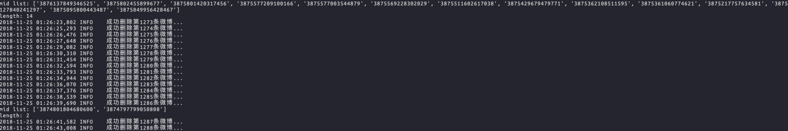

# Xweibo

被「新浪微勃」恶心到了，事件详情请见[王思聪杀死微博](https://www.huxiu.com/article/271396.html)，决定删除所有微博动态。


## 使用说明

步骤一：获取代码到本地：

```bash
git clone https://github.com/Neulana/Xweibo.git
```

步骤二：打开项目所在文件夹，找到src/config.py，编辑**WEIBO_USERNAME**和**WEIBO_PASSWORD**，分别替换成你自己的**用户名**和**密码**，这里的用户名**不是昵称**，是用户登录的账号名。

步骤三：运行脚本：

```bash
cd Xweibo
python src/del.py
```

## 使用效果



### 

|              运行前              |             运行后             |
| :------------------------------: | :----------------------------: |
|  |  |


## **TODO**

- [ ] 增加批量取关功能，仅保留互关好友（针对微博买粉丝的现象，自动帮你关注博主）


最后，要是您觉得有用的话，点个star吧，这是对我最大的鼓励，谢谢啦~